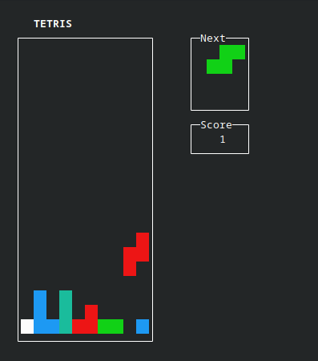

# Tetris
A simple terminal-based implementation of Tetris written in C using ncurses library for the UI.



## Requirements
- C compiler (e.g. gcc)
- ncurses
- a terminal with color support

## Build

Build the project with
```bash
make
```

## Run

```bash
./main
```

## Controls

| Key | Action |
| --- | ----------- |
| ← / → | Move piece left/right |
| ↑ or X | Rotate clockwise |
| Z | Rotate counter-clockwise |
| ↓ | Soft drop |
| Space | Hard drop |
| Q | Quit |
